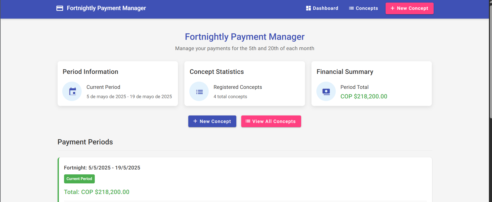

# Fortnightly Payment Manager

Fortnightly Payment Manager is an Angular application designed to help users manage and calculate recurring payments on a fortnightly basis. The application allows users to define payment concepts, calculate costs based on selected days, and manage payment periods. It is currently a static application using **LocalStorage** for data persistence but is structured to integrate with an API in the future for full CRUD functionality.

## Demo

Here you can check a Demo Deployed on Netlify:

https://calculador-quincenas.netlify.app/dashboard

## Features

- **Payment Concept Management**: Create, edit, and delete payment concepts such as "Transport" or "Mom's Payment."
- **Cost Calculation**:
  - Calculate costs based on selected weekdays within a fortnightly period.
  - Calculate costs for weekends within a fortnightly period.
- **Customizable Frequency**: Define daily fixed costs and adjust the weekly frequency for each concept.
- **Fortnightly Periods**: Automatically generates two payment periods per month:
  - **1st Period**: From the 5th to the 19th of the month.
  - **2nd Period**: From the 20th to the 4th of the following month.

## Application Preview

  
*Placeholder for a static image of the application.*

## Technologies Used

- **Angular**: Framework for building the application.
- **Angular Material**: For UI components such as tables, forms, and dialogs.
- **RxJS**: For reactive data handling.
- **SCSS**: For styling.
- **LocalStorage**: Temporary data storage until API integration.

## How to Run the Application

1. **Clone the Repository**:
   ```bash
   git clone <repository-url>
   cd fortnights-prediction
   ```

2. **Install Dependencies**:
   ```bash
   npm install
   ```

3. **Run the Application**:
   ```bash
   ng serve
   ```

4. **Access the Application**:
   Open your browser and navigate to `http://localhost:5000`.

## Future Enhancements

- **API Integration**: Replace LocalStorage with API calls for full CRUD functionality.
- **Authentication**: Add user authentication for secure access.
- **Advanced Reporting**: Generate detailed reports for payment history and trends.
